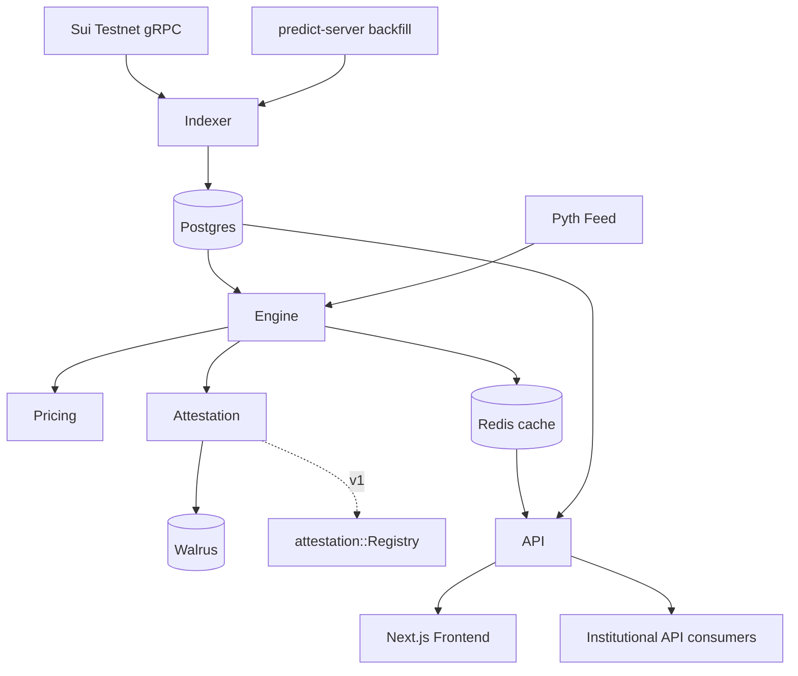

# Sui Transparency Hub — System Architecture Specification

> Version: 0.2 (Hackathon MVP architecture — **on-chain ABI verified**)
> Date: 2026-05-28 (v0.1) · 2026-05-30 (v0.2 verification pass)
> Source: derived from `BUSINESS_SPEC.md` v1; schema corrected against the live testnet package (Appendix B)
> Target network: Sui **testnet** (Protocol 124 / v1.72.2)
> Scope: MVP (6-week hackathon) with explicit v1/v2 extension points
>
> **v0.2 changelog (breaking corrections):** real event names verified — deleted non-existent `plp::*` and `predict::{Redeemed,MarketSettled}` events; PLP metrics now sourced from `Predict` **object state** not events; pricing model corrected to **binary digital options** (no BS inversion, monotone-digital no-arb); Pyth demoted (protocol oracle gives spot+forward); fixed-point scales pinned (1e9 vs DUSDC 6-dec; `i64` sign-magnitude). See Appendix B.

---

## 1. Executive Summary

This document specifies the system architecture for **Sui Transparency Hub** — a Sui-native analytics console for DeepBook Predict that delivers:

1. Live 3D SVI vol surface (with time-travel + arb-free flags).
2. PLP risk dashboard (utilization, withdrawal-bucket, per-strike inventory, ±5σ stress).
3. Walrus-attested risk reports (tamper-evident, citable provenance).
4. Public REST / WebSocket API for institutional consumers.

The MVP is **off-chain heavy, on-chain light**: no new Move contracts are required for the demo path; a small `AttestationRegistry` Move module is introduced in v1 to anchor Walrus blob digests on-chain. Core engineering load is in: (a) a custom Sui indexer subscribing to `oracle::OracleSVIUpdated` + PLP object mutations, (b) an SVI evaluation + arb-free checker service, (c) a snapshot/attestation pipeline pinning canonicalized JSON to Walrus, and (d) a Next.js + Three.js front-end.

---

## 2. System Context

```
        ┌─────────────────────┐
        │  Sui Testnet (Full  │
        │  Node + gRPC + WS)  │
        └──────────┬──────────┘
                   │ events / object reads (gRPC primary)
                   ▼
        ┌─────────────────────┐         ┌──────────────────┐
        │  Ingest / Indexer   │────────►│  Postgres (hot,  │
        │  (Rust or Node)     │         │  30-day window)  │
        └──────────┬──────────┘         └────────┬─────────┘
                   │ normalized events           │
                   ▼                             │
        ┌─────────────────────┐                  │
        │  Pricing & Risk     │◄─────────────────┘
        │  Engine (SVI eval,  │
        │  arb-free, Greeks,  │
        │  ±σ stress)         │
        └──────────┬──────────┘
                   │ snapshots
                   ├───────────────► Walrus (blob storage)
                   │                  │
                   │                  ▼ blob_id, sha256
                   │            ┌──────────────────┐
                   │            │ AttestationReg.  │ (v1, Move)
                   │            │  shared object   │
                   │            └──────────────────┘
                   ▼
        ┌─────────────────────┐
        │  API Gateway        │
        │  REST + WS + GraphQL│
        └──────────┬──────────┘
                   ▼
        ┌─────────────────────┐
        │  Next.js Frontend   │
        │  (Three.js + Plotly)│
        └─────────────────────┘
```

Upstream dependencies:
- **DeepBook Predict** protocol on Sui testnet — package `0xf5ea2b3749c65d6e56507cc35388719aadb28f9cab873696a2f8687f5c785138`, `Predict` shared object `0xc8736204d12f0a7277c86388a68bf8a194b0a14c5538ad13f22cbd8e2a38028a` (events + object state). **Verified on-chain 2026-05-30 — see Appendix B.**
- **Protocol oracle** (`oracle::OraclePricesUpdated`) is the **primary** spot + forward source — the protocol publishes both directly. **Pyth is demoted to an optional cross-check**, not the price hot path (corrects v0.1 which assumed Pyth-primary).
- **`predict-server.testnet.mystenlabs.com`** as backfill / replay source. Confirmed live endpoints: `GET /config` (→ `predict_id`, quote assets), `GET /oracles` (→ per-oracle `{oracle_id, oracle_cap_id, underlying_asset, expiry, min_strike, tick_size, status, settlement_price}`).
- **Walrus** testnet for blob attestation.

---

## 3. Module Decomposition

### 3.1 `indexer/` — Sui event & object ingest
- Language: **Rust** (preferred for sustained throughput) or Node/TS fallback.
- Connects via **gRPC** (primary; JSON-RPC deprecated per Protocol 124).
- Uses Sui Indexer framework's `ConcurrencyConfig` (Protocol 124 removed `Processor::FANOUT`).
- **Event subscriptions — VERIFIED against the deployed package (2026-05-30). The v0.1 names below the line were guesses and are wrong; these are the real ones:**
  - `oracle::OracleSVIUpdated` — `{ oracle_id: ID, a: u64, b: u64, rho: i64::I64, m: i64::I64, sigma: u64, timestamp: u64 }` ← drives the surface.
  - `oracle::OraclePricesUpdated` — `{ oracle_id: ID, spot: u64, forward: u64, timestamp: u64 }` ← spot/forward for Greeks + log-moneyness `F`.
  - `oracle::OracleActivated` — `{ oracle_id, expiry, timestamp }`.
  - `oracle::OracleSettled` — `{ oracle_id, expiry, settlement_price, timestamp }` (this is the real "market settled", **not** `predict::MarketSettled`).
  - `predict::Supplied` — `{ predict_id, supplier, quote_asset: TypeName, amount, shares_minted }` ← PLP deposit.
  - `predict::Withdrawn` — `{ predict_id, withdrawer, quote_asset, amount, shares_burned }` ← PLP withdraw (the real redeem event, **not** `predict::Redeemed`).
  - `predict::PositionMinted` / `predict::PositionRedeemed` — binary up/down trades: `{ …, oracle_id, expiry, strike, is_up, quantity, cost|payout, ask_price|bid_price }`. **Per-strike inventory deltas are reconstructed from these** (no `plp::InventoryDelta` event exists).
  - `predict::RangeMinted` / `predict::RangeRedeemed` — range bets: `{ …, lower_strike, higher_strike, quantity, … }`.
  - Config/health: `predict::PricingConfigUpdated`, `predict::RiskConfigUpdated`, `predict::TradingPauseUpdated`, `predict::OracleAskBoundsSet|Cleared`, `predict::QuoteAssetEnabled|Disabled`.

  > ❌ **Deleted (do not exist on-chain):** `plp::UtilizationChanged`, `plp::WithdrawalBucketChanged`, `plp::InventoryDelta`, `predict::Redeemed`, `predict::MarketSettled`. The `plp` module is a phantom marker (`PLP { dummy_field: bool }`) and **emits zero events** — PLP state is read from object state, see §3.3.
- **Object-state polling (new, required):** PLP / vault metrics have **no events**. The indexer additionally reads the `Predict` shared object (and its nested `vault.oracle_matrices: Table<oracle_id, StrikeMatrix>`) once per checkpoint (or every N checkpoints) and diffs to derive utilization, withdrawal-bucket, and per-strike inventory time-series.
- Backfill: replay from `predict-server` REST/WS until live cursor catches up.
- Writes normalized events to Postgres `events_*` tables (idempotent by `(tx_digest, event_seq)`); writes object snapshots to `state_*` tables keyed by `(checkpoint, object_id)`.
- **Decoding rules (footguns):** `i64::I64` is **sign-magnitude** `{ magnitude: u64, is_negative: bool }` → decode as `(is_negative ? -1 : 1) * magnitude`, NOT two's-complement. Prices/strikes/SVI params are **1e9 fixed-point**; quote-asset amounts (`amount`, `cost`, `payout`) are **DUSDC 6-decimal** — two different scales in the same event stream (see Appendix B).

### 3.2 `pricing/` — SVI evaluation + arb-free + Greeks
- Pure library, exposed via in-process call from `engine/` and via API.
- Inputs: `{a, b, rho, m, sigma}` (all **1e9 fixed-point**; `rho, m` decoded from `i64::I64`) per expiry from `OracleSVIUpdated`, plus `{spot, forward}` from `OraclePricesUpdated` and `T = (expiry - now)`.
- **Instrument model correction:** DeepBook Predict trades **binary (up/down) digital options**, not vanilla calls. The protocol prices them **on-chain** via `oracle::compute_price` / `oracle::binary_price_pair` using `math::normal_cdf`. Therefore:
  - **IV is NOT inverted from price** — SVI *is* the IV parametrization. `IV(K,T) = sqrt(w(k,T) / T)`. No Black–Scholes inversion step (v0.1 was wrong to require it).
  - The protocol's own up-price curve (`oracle_config::CurvePoint { strike, up_price }`, `up_price` in 1e9 = digital probability) is the **ground-truth price**; our job is to (a) render IV surface, (b) re-derive Greeks, (c) check no-arb on the *digital* curve.
- Outputs:
  - `iv_grid[K][T]` — implied vol surface from SVI (no inversion).
  - `greeks{delta, gamma, vega, theta}` per (K, T) — for a **digital** payoff (delta = ∂(up_price)/∂S, etc.; gamma/vega are the digital second-order forms, not vanilla).
  - `arb_flags{monotone[K,T], bounds[K,T], calendar[T]}`.
- Math:
  - Log-moneyness `k = ln(K / F)` with **`F = forward` taken directly from `OraclePricesUpdated`** (no Pyth needed; forward is given).
  - Total variance `w(k) = a + b * (rho * (k - m) + sqrt((k - m)^2 + sigma^2))`.
  - **No-arb for digitals (corrected):** a digital up-option price equals the risk-neutral `P(S_T ≥ K)`, so it must be **monotone non-increasing in `K`** and lie in `[0, 1]`. The arb-free check is therefore: `up_price(K_i) ≥ up_price(K_{i+1})` (monotonicity ⇔ butterfly/density ≥ 0 for digitals) and `0 ≤ up_price ≤ 1e9`. This replaces the v0.1 `d²C/dK² ≥ 0` on vanilla call prices, which is the wrong condition for this protocol.
  - **Calendar:** total variance `w` non-decreasing in `T` across consecutive expiries — unchanged, still correct.
- Determinism: same SVI params → same surface bytes (critical for attestation hash). All math runs in **fixed 1e9 integer/`f64` IEEE-754** to mirror on-chain `math` and keep hashes stable across hosts.

### 3.3 `engine/` — Risk snapshot + stress simulator
- Consumes Postgres state + `pricing/` outputs.
- **PLP metrics come from `Predict` object state, not events (corrected).** The `Predict` shared object holds:
  - `vault: Vault { balance: u64, total_mtm: u64, total_max_payout: u64, oracle_matrices: Table<ID, StrikeMatrix>, settled_oracles: Table<…, SettledOracleState>, balances: Bag }`
  - `withdrawal_limiter: rate_limiter::RateLimiter { available, capacity, refill_rate_per_ms, last_updated_ms, enabled }`
  - `trading_paused: bool`
- Derived metrics (verified field-by-field on live state, Appendix B):
  - `utilization = total_max_payout / balance` (live: `1692900173 / 1003776333821 ≈ 0.17%`). All amounts **DUSDC 6-decimal**.
  - `nav = balance + total_mtm` (or protocol's accounting convention — confirm against `vault` accessor before mainnet).
  - `withdraw_bucket_headroom = available / capacity` **iff `enabled`**; on testnet the limiter is currently `enabled = false, capacity = 0` → **gauge must special-case "disabled" and not divide by zero**.
  - `per_oracle_exposure` = iterate `oracle_matrices` (live size 19) → `StrikeMatrix { mtm, range_qty, … }` per oracle.
  - `per_strike_inventory` = `StrikeMatrix.pages → StrikeNode { q_up, q_dn, … }` per strike (this is the heatmap source; no event feed needed, though `PositionMinted/Redeemed` give an incremental fast-path).
  - `settled_oracles` (live size 3059) → `SettledOracleState { remaining_quantity, remaining_liability }` powers resolution-risk telemetry (v1).
- Produces:
  - `PLPSnapshot { utilization, withdraw_bucket, withdraw_enabled, per_oracle_exposure, per_strike_inventory, nav, balance, total_mtm, total_max_payout, ts }`
  - `StressResult { sigma_shock, projected_nav_delta_pct, worst_strikes[] }` — stress re-prices `total_max_payout`/`total_mtm` by shocking spot ±Xσ through the SVI surface and re-summing per-strike `q_up/q_dn` liabilities.
- Owns the **canonicalization** step: sorted JSON keys, fixed numeric precision, UTF-8 → SHA256.
- Snapshot cadence: 5-min for surface, 1-min for PLP (object read), on-demand for stress.

### 3.4 `attestation/` — Walrus pinning + (v1) on-chain registry
- MVP: snapshot bytes → Walrus `PUT` → store `{blob_id, sha256, ts, kind}` in Postgres + return `walrus://blob/<id>` to user.
- v1: PTB call into `attestation::register(&mut Registry, blob_id, sha256, ts)` on the `AttestationRegistry` shared object — enables on-chain verifiability and "did this snapshot exist at this height" proofs.

### 3.5 `api/` — REST + WS (+ GraphQL in v1)
- Framework: **Fastify (Node/TS)** for MVP velocity, Axum (Rust) optional for v1.
- Endpoints (MVP):
  - `GET /v1/surface/btc?expiry=1h` → `{ svi_params, arb_flags, iv_grid, last_update_ts, walrus_attestation? }`
  - `GET /v1/plp/state` → `PLPSnapshot`
  - `POST /v1/plp/stress { sigma }` → `StressResult`
  - `POST /v1/attest/{surface|plp}` → triggers snapshot + pin; returns `{ blob_id, sha256, walrus_uri }`
  - `WS /v1/stream` channels: `surface.btc.updated`, `plp.updated`
- Auth: API-key header (`x-api-key`) for Pro+ tiers; free tier rate-limited by IP.

### 3.6 `web/` — Next.js dashboard
- Pages:
  - `/` — Surface Studio (3D Three.js mesh, time-travel slider, arb-flag overlays).
  - `/plp` — risk dashboard (gauges via Plotly, heatmap, ±σ slider).
  - `/reports/[blob_id]` — attestation viewer with SHA re-verification.
  - `/api-docs` — OpenAPI-rendered docs.
- State: TanStack Query (REST polling 5s) + native WS for surface push.
- Wallet: `@mysten/dapp-kit-react` (only needed to sign the optional v1 `attestation::register` PTB).

### 3.7 `move/attestation/` — On-chain registry (v1 only)
- Single module `attestation`:
  ```move
  public struct Registry has key { id: UID, count: u64 }
  public struct Record has store, copy, drop {
      blob_id: vector<u8>, sha256: vector<u8>, ts_ms: u64, kind: u8, submitter: address
  }
  public entry fun register(reg: &mut Registry, blob_id: vector<u8>,
                            sha256: vector<u8>, ts_ms: u64, kind: u8, ctx: &TxContext)
  ```
- Emits `RecordRegistered` event for downstream indexers.
- No admin cap in v1 (anyone can register; off-chain layer dedupes by `sha256`); admin/role-gating deferred to v2 if buyer-discovery confirms institutional demand for it.

---

## 4. Data Model (Postgres, MVP)

All on-chain integers stored as `NUMERIC`/`BIGINT` in **raw 1e9 or 6-dec units** (no lossy float conversion at ingest); scaling to human units happens in the API/serialization layer. Signed `i64::I64` values are stored as a single signed `NUMERIC` after decode.

```sql
-- raw events (append-only, idempotent) — fields match verified on-chain ABI (Appendix B)
CREATE TABLE events_oracle_svi (
  tx_digest TEXT, event_seq INT,
  oracle_id TEXT,
  a NUMERIC, b NUMERIC, sigma NUMERIC,   -- u64, 1e9 fixed-point
  rho NUMERIC, m NUMERIC,                -- i64 decoded (signed), 1e9 fixed-point
  ts_ms BIGINT,
  PRIMARY KEY (tx_digest, event_seq)
);

CREATE TABLE events_oracle_prices (
  tx_digest TEXT, event_seq INT,
  oracle_id TEXT,
  spot NUMERIC, forward NUMERIC,         -- u64, 1e9 fixed-point
  ts_ms BIGINT,
  PRIMARY KEY (tx_digest, event_seq)
);

-- PLP liquidity flow (predict::Supplied / Withdrawn) — there are NO plp::* events
CREATE TABLE events_plp_flow (
  tx_digest TEXT, event_seq INT,
  kind TEXT,                 -- 'supplied' | 'withdrawn'
  actor TEXT,                -- supplier | withdrawer
  quote_asset TEXT,
  amount NUMERIC,            -- DUSDC 6-decimal
  shares NUMERIC,            -- shares_minted | shares_burned
  ts_ms BIGINT,
  PRIMARY KEY (tx_digest, event_seq)
);

-- trades (drives incremental per-strike inventory) — predict::Position*/Range*
CREATE TABLE events_trade (
  tx_digest TEXT, event_seq INT,
  kind TEXT,                 -- 'position_minted'|'position_redeemed'|'range_minted'|'range_redeemed'
  oracle_id TEXT, expiry_ms BIGINT,
  strike NUMERIC, higher_strike NUMERIC,   -- 1e9; higher_strike NULL for binary
  is_up BOOLEAN,                            -- NULL for range
  quantity NUMERIC, price NUMERIC,          -- price = ask/bid, 1e9; quantity in contract units
  amount NUMERIC,                           -- cost|payout, DUSDC 6-decimal
  ts_ms BIGINT,
  PRIMARY KEY (tx_digest, event_seq)
);

CREATE TABLE events_oracle_settled (
  tx_digest TEXT, event_seq INT,
  oracle_id TEXT, expiry_ms BIGINT,
  settlement_price NUMERIC,   -- 1e9
  ts_ms BIGINT,
  PRIMARY KEY (tx_digest, event_seq)
);

-- object-state snapshots (polled per checkpoint; PLP/vault have no events)
CREATE TABLE state_vault (
  checkpoint BIGINT, ts_ms BIGINT,
  balance NUMERIC, total_mtm NUMERIC, total_max_payout NUMERIC,  -- DUSDC 6-dec
  withdraw_available NUMERIC, withdraw_capacity NUMERIC,
  withdraw_refill_per_ms NUMERIC, withdraw_enabled BOOLEAN,
  trading_paused BOOLEAN,
  PRIMARY KEY (checkpoint)
);

CREATE TABLE state_strike_matrix (
  checkpoint BIGINT, oracle_id TEXT, strike NUMERIC,  -- 1e9
  q_up NUMERIC, q_dn NUMERIC,
  PRIMARY KEY (checkpoint, oracle_id, strike)
);

-- derived snapshots (5-min surface, 1-min PLP)
CREATE TABLE snapshots_surface (
  ts_ms BIGINT PRIMARY KEY,
  svi_params JSONB,
  arb_flags JSONB,
  iv_grid_compact BYTEA   -- f32 grid, length-prefixed
);

CREATE TABLE snapshots_plp (
  ts_ms BIGINT PRIMARY KEY,
  utilization NUMERIC,
  withdraw_bucket NUMERIC,
  withdraw_enabled BOOLEAN,
  per_oracle_exposure JSONB,
  per_strike_inventory JSONB,
  nav NUMERIC
);

-- attestations
CREATE TABLE attestations (
  blob_id TEXT PRIMARY KEY,
  sha256 BYTEA NOT NULL,
  kind TEXT NOT NULL,         -- 'surface' | 'plp' | 'report'
  ts_ms BIGINT NOT NULL,
  walrus_uri TEXT NOT NULL,
  on_chain_tx TEXT            -- v1: PTB digest of register() call
);
CREATE INDEX ON attestations (kind, ts_ms DESC);
```

Retention: 30 days hot in Postgres; older snapshots tier to S3 / R2 (cheap object store). Walrus blobs themselves persist per Walrus storage epoch policy.

---

## 5. Sequence Flows

### 5.1 Live surface update
1. Sui emits `OracleSVIUpdated`.
2. `indexer` writes row to `events_oracle_svi`.
3. `engine` is triggered (LISTEN/NOTIFY or in-process channel) → calls `pricing/` → produces `IVGrid + ArbFlags`.
4. Result cached in Redis (`surface:btc:latest`).
5. API pushes via WS to subscribed clients; REST `GET /v1/surface/btc` reads from cache.

### 5.2 Generate Risk Report (Karthik flow)
1. User clicks "Generate Risk Report" → `POST /v1/attest/plp` with optional `{ sigma }` for stress overlay.
2. `engine` builds `PLPSnapshot` (+ `StressResult` if requested) → canonicalizes JSON → SHA256.
3. `attestation/` uploads bytes to Walrus → receives `blob_id`.
4. (v1) Backend signs + submits PTB to `attestation::register`.
5. Row inserted into `attestations`. Response: `{ walrus_uri, sha256, on_chain_tx? }`.
6. User opens `/reports/[blob_id]` → frontend re-fetches blob, recomputes SHA256, displays ✅ / ❌.

---

## 6. Security Considerations

| Threat | Vector | Mitigation |
|---|---|---|
| Attestation forgery | Attacker uploads tampered JSON claiming to be a Hub snapshot | (v1) on-chain `register()` from a known submitter address; verifiable client-side via Sui RPC |
| SVI param spoofing | Bad indexer write inserts fake `OracleSVIUpdated` | Idempotent `(tx_digest, event_seq)` PK; reconcile against `predict-server` backfill hourly |
| Greeks / NAV computation drift | Floating-point non-determinism across hosts breaks attestation hash | Fix to `f64` with explicit IEEE-754 ops; canonicalization uses scaled integer string form |
| API DoS | Free-tier scrapers exhaust DB | IP rate limit + Redis cache TTLs (`surface` 5s, `plp` 30s); paid tiers bypass via API key |
| Stale Pyth feed during demo | Pyth halts → spot 0 → BS inversion explodes | Last-known-good cache with prominent "last update" badge + degraded-mode banner |
| Walrus availability | Walrus testnet outage breaks "Generate Report" | Async queue with retry; UI surfaces pending state; SHA256 still computed and shown |
| Move `AttestationRegistry` abuse (v1) | Anyone can register junk records | Off-chain UI filters by trusted submitter address; v2 adds optional `RegistrarCap` allow-list |
| **Sign-magnitude decode bug** | `i64::I64` read as two's-complement → `rho`/`m` sign flips → entire smile mirrored | Decode `(is_negative ? -1 : 1) * magnitude`; golden-vector test against the live `rho = -0.94` sample (Appendix B) |
| **Dual-scale unit mixing** | Treating DUSDC 6-dec `amount` as 1e9 (or vice-versa) → NAV/utilization off by 1000× | Tag every column with its scale in the schema; one central `scale()` helper; assert `utilization ∈ [0,1]` post-compute |
| **Withdrawal limiter disabled** | Testnet `capacity = 0, enabled = false` → `available/capacity` divides by zero | Branch on `enabled`; render "limiter off" badge instead of a gauge when `capacity = 0` |
| **SVI degenerate inputs** | `sigma = 0`, `b = 0`, `\|rho\| = 1` → `sqrt` / variance edge cases | Clamp + guard in `pricing/`; monkey-fuzz (see §9); never panic, emit `arb_flag` instead |

Red-team checklist explicitly run against `attestation` module before mainnet (per project rules):
1. Access control bypass — no admin in v1; explicit by design.
2. Integer overflow — `count: u64` increments; saturating not required at realistic rates.
3. Object manipulation — `Registry` is shared; only `count` mutates; no UID transfers.
4. Economic exploit — N/A (no value held).
5. DoS — spam `register` calls inflate gas cost for legitimate users; mitigation: paid-tier-only backend submitter, or per-tx fee in v2.

---

## 7. SUI Ecosystem Tool Integration

| Tool | Use | Phase |
|---|---|---|
| **Walrus** | Snapshot blob storage | MVP |
| **Protocol oracle** (`OraclePricesUpdated`) | **Primary** spot + forward | MVP |
| **Pyth** | Optional spot cross-check only (demoted — protocol provides spot+forward) | v1 nice-to-have |
| **DeepBook Predict** events/objects | Primary data source | MVP |
| **Sui Indexer framework** | Ingest pipeline (`ConcurrencyConfig`) | MVP |
| **@mysten/dapp-kit-react** | Wallet sign for `register()` PTB | v1 |
| **Display V2** | If we ever mint per-report NFT receipts | v2 (deferred) |
| **SuiNS** | Resolve human-readable submitter names on attestation viewer | v1 nice-to-have |

Explicitly **not used**: Kiosk, Seal, zkLogin, Passkey, Nautilus — none of these fit the transparency-layer use case.

---

## 8. Data Access Pattern (per Protocol 124 guidance)

- **gRPC (primary):** indexer subscribes to live events here. JSON-RPC is deprecated; do not use Quorum Driver.
- **GraphQL beta:** frontend uses for any on-demand owned-object reads (e.g., user-side wallet display) — not on the surface hot path.
- **Custom indexer (this project):** owns historical analytics + aggregation (per `sui-indexer` guidance).

Rationale for custom indexer vs Suivision/BlockVision: those don't model SVI, withdrawal-bucket token-bucket state, or per-strike `Bag` inventory — verified in BUSINESS_SPEC §2.

---

## 9. Testing Strategy

- **Unit (pricing/):** golden-vector SVI evals against Black–Scholes reference; arb-free checker against synthetic violating surfaces.
- **Property:** canonicalization round-trips (`bytes → JSON → bytes` stable); SHA stable across machines.
- **Integration:** spin local Postgres + mock Sui event firehose; assert end-to-end snapshot determinism.
- **Move (v1):** `sui move test` for `attestation::register` happy-path + concurrent submitters.
- **Monkey:** random fuzz of SVI params including `sigma=0`, `b=0`, extreme `rho`; ensure no panics, only well-typed `ArbFlag` outputs.
- **Demo failsafe:** mock SVI generator that replays a known-interesting historical window (per BUSINESS_SPEC §13).

---

## 10. Deployment Plan

| Env | Sui network | Hosting | Purpose |
|---|---|---|---|
| dev | testnet | local Docker compose | iteration |
| staging | testnet | Fly.io / Railway | demo dry-run |
| prod (hackathon) | testnet | Vercel (web) + Fly.io (api/indexer) + Neon (Postgres) + Upstash (Redis) | judging demo |
| v1 prod | mainnet | same stack, Move package published with `UpgradeCap` retained | post-hackathon |

Move publish (v1 only): staged devnet → testnet → mainnet using `sui-deployer` skill. `UpgradeCap` held by team multisig.

---

## 11. Gas & Cost

- MVP: zero on-chain writes from our side. Gas cost = $0.
- v1 `attestation::register`: ~1-2k Sui gas units per call; at 1 snapshot/5min = 288/day → trivial.
- Walrus: blob size ~5-50 KB per snapshot; cost dominated by Walrus storage epoch fee — pass through to Pro+ tiers (BUSINESS_SPEC §14 Q2).

---

## 12. Module Dependency (Mermaid)



---

## 13. Open Decisions (deferred, not blocking MVP)

These map to BUSINESS_SPEC §14:
1. Resolution-risk monitoring tier placement (Pro vs separate).
2. Walrus cost pass-through model.
3. Cross-venue smile comparison data sources (Deribit / Polymarket adapters).
4. On-chain `AttestationRegistry` vs pure off-chain — current spec assumes on-chain registry **enabled in v1**, defer to buyer interviews before mainnet.
5. Open-source indexer vs closed risk models — current spec assumes **indexer = OSS, engine = closed**.

---

## 14. Out of Scope (MVP)

- Multi-asset surfaces (ETH/SUI) — v1.
- Alerts engine (webhook/Telegram/email) — v1.
- Historical drawdown replay across arbitrary 30-day windows — v1.
- Cross-protocol risk (Scallop/Navi/Suilend) — v2.
- White-label SDK — v2.
- PDF report rendering — v1 (MVP exports JSON only).

---

## 15. Appendix A — Versions

- Sui: testnet v1.72.2 / Protocol 124 (local CLI verified: `sui 1.71.0`)
- SDK: `@mysten/sui` (NOT `@mysten/sui.js`); `Transaction` (NOT `TransactionBlock`)
- Move edition: 2024
- Node: 20 LTS; Rust: stable 1.78+ if Rust indexer chosen
- Postgres: 16; Redis: 7
- Next.js: 15 App Router; Three.js: r160+; Plotly.js: 2.x

---

## 16. Appendix B — Verified On-Chain ABI (testnet, 2026-05-30)

Ground-truth pulled directly from the deployed package via `sui_getNormalizedMoveModulesByPackage` + live `suix_queryEvents` + `sui_getObject`. **This supersedes any guessed schema elsewhere in this doc.**

- **Package:** `0xf5ea2b3749c65d6e56507cc35388719aadb28f9cab873696a2f8687f5c785138`
- **`Predict` shared object:** `0xc8736204d12f0a7277c86388a68bf8a194b0a14c5538ad13f22cbd8e2a38028a` (type `…::predict::Predict`)
- **Quote asset:** `…::dusdc::DUSDC` (6 decimals)
- **Modules:** `constants, i64, market_key, math, oracle, oracle_config, plp, predict, predict_manager, pricing_config, range_key, rate_limiter, registry, risk_config, strike_matrix, treasury_config, vault`

### Events (all `[Copy,Drop,Store]`)

| Event | Fields |
|---|---|
| `oracle::OracleSVIUpdated` | `oracle_id: ID, a: u64, b: u64, rho: i64, m: i64, sigma: u64, timestamp: u64` |
| `oracle::OraclePricesUpdated` | `oracle_id: ID, spot: u64, forward: u64, timestamp: u64` |
| `oracle::OracleActivated` | `oracle_id: ID, expiry: u64, timestamp: u64` |
| `oracle::OracleSettled` | `oracle_id: ID, expiry: u64, settlement_price: u64, timestamp: u64` |
| `predict::Supplied` | `predict_id: ID, supplier: address, quote_asset: TypeName, amount: u64, shares_minted: u64` |
| `predict::Withdrawn` | `predict_id: ID, withdrawer: address, quote_asset: TypeName, amount: u64, shares_burned: u64` |
| `predict::PositionMinted` | `predict_id, manager_id, trader, quote_asset, oracle_id, expiry, strike, is_up: bool, quantity, cost, ask_price` |
| `predict::PositionRedeemed` | `…, owner, executor, …, strike, is_up, quantity, payout, bid_price, is_settled: bool` |
| `predict::RangeMinted` | `…, trader, …, lower_strike, higher_strike, quantity, cost, ask_price` |
| `predict::RangeRedeemed` | `…, lower_strike, higher_strike, quantity, payout, bid_price, is_settled` |
| `predict::{PricingConfigUpdated, RiskConfigUpdated, TradingPauseUpdated, OracleAskBoundsSet, OracleAskBoundsCleared, QuoteAssetEnabled, QuoteAssetDisabled}` | config/health |
| `predict_manager::PredictManagerCreated` | `manager_id: ID, owner: address` |

> `plp` module = `PLP { dummy_field: bool }` — **no events**. PLP state is object-state only.

### Key object structs (read, not events)

```
predict::Predict { vault: Vault, withdrawal_limiter: RateLimiter, trading_paused: bool,
                   pricing_config, risk_config, treasury_config, oracle_config, treasury_cap }
vault::Vault     { balance: u64, total_mtm: u64, total_max_payout: u64,
                   oracle_matrices: Table<ID, StrikeMatrix>, settled_oracles: Table, balances: Bag }
rate_limiter::RateLimiter { available: u64, capacity: u64, refill_rate_per_ms: u64,
                            last_updated_ms: u64, enabled: bool }
strike_matrix::StrikeMatrix { pages, tick_size, min_strike, max_strike, mtm, range_qty, … }
strike_matrix::StrikeNode    { q_up, q_dn, agg_q_up, agg_qk_up, agg_q_dn, agg_qk_dn }
vault::SettledOracleState    { remaining_quantity: u64, remaining_liability: u64 }
oracle_config::CurvePoint    { strike: u64, up_price: u64 }   // up_price = digital prob, 1e9
i64::I64                     { magnitude: u64, is_negative: bool }   // sign-magnitude
```

### Fixed-point scales (empirically confirmed from live values)

| Quantity | Scale | Live sample → human |
|---|---|---|
| spot / forward / strike | **1e9** | `73872960390776` → $73,872.96 |
| binary price (`ask_price`, `up_price`) | **1e9** ∈ [0,1] | `498226631` → 0.498 prob |
| SVI `a, b, sigma` | **1e9** | `sigma 1000000` → 0.001 |
| SVI `rho, m` (`i64`) | **1e9**, signed | `rho {neg, 940000001}` → −0.94 |
| quote amounts (`amount, cost, payout`) | **DUSDC 6-dec** | `amount 4500000` → 4.5 DUSDC |
| `timestamp` | ms epoch | `1780151042893` |

### Live vault state snapshot (2026-05-30)

```
balance            1003776333821   (~1,003,776 DUSDC)
total_mtm          875624199       (~875.6 DUSDC)
total_max_payout   1692900173      (~1,692.9 DUSDC)
utilization        ≈ 0.17%   (= total_max_payout / balance)
withdrawal_limiter { enabled: false, capacity: 0, available: 0, refill_rate_per_ms: 0 }
oracle_matrices    19 active   |   settled_oracles 3059   |   balances_bag 1 (DUSDC)
trading_paused     false
```

### On-chain math available (mirror these for determinism)

`math::{ exp, ln, sqrt, normal_cdf, mul_div_round_down, mul_div_round_up }`,
`oracle::{ compute_price, binary_price_pair, forward_price, spot_price, svi_a, svi_b, svi_rho, svi_m, svi_sigma }`.

### Reproduce

```bash
PKG=0xf5ea2b3749c65d6e56507cc35388719aadb28f9cab873696a2f8687f5c785138
RPC=https://fullnode.testnet.sui.io:443
# modules + ABI
curl -s $RPC -H 'Content-Type: application/json' \
  -d "{\"jsonrpc\":\"2.0\",\"id\":1,\"method\":\"sui_getNormalizedMoveModulesByPackage\",\"params\":[\"$PKG\"]}"
# latest SVI event
curl -s $RPC -H 'Content-Type: application/json' \
  -d "{\"jsonrpc\":\"2.0\",\"id\":1,\"method\":\"suix_queryEvents\",\"params\":[{\"MoveEventType\":\"$PKG::oracle::OracleSVIUpdated\"},null,1,true]}"
# config from predict-server
curl -s https://predict-server.testnet.mystenlabs.com/config
curl -s https://predict-server.testnet.mystenlabs.com/oracles
```
